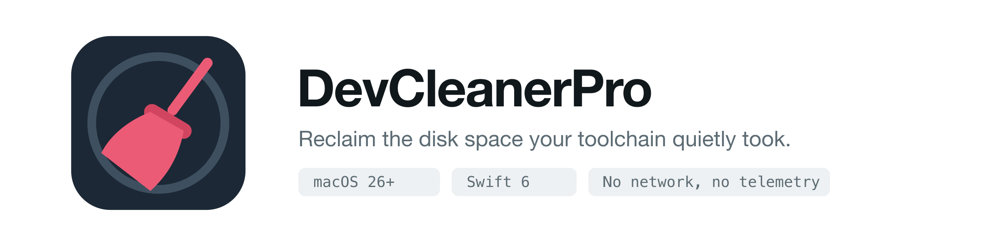

<p align="center">
  <picture>
    <source media="(prefers-color-scheme: dark)" srcset="docs/images/hero-dark.png">
    
  </picture>
</p>

<p align="center">
  <a href="https://github.com/vvodicka/dev-cleaner-pro/releases/latest"></a>
  <a href="https://github.com/vvodicka/dev-cleaner-pro/releases"></a>
  
  
  <a href="LICENSE"></a>
</p>

A macOS app that measures where a developer's disk went and deletes what you choose — to the
Trash or permanently. Launch it, clean, quit. No background agent, no scheduler, no network, no
telemetry.

It found **483 GB** on the machine it was built on, including 59 GB of orphaned simulator runtime
images that nothing on the system refers to any more.

## Install

```sh
brew tap vvodicka/tap
brew trust vvodicka/tap
brew install --cask devcleanerpro
```

`brew trust` is not ceremony — Homebrew 6 refuses to load casks from a tap you have not
explicitly trusted, and the install fails with "No Cask with this name exists" until you do.

Or download the `.dmg` from [Releases](https://github.com/vvodicka/dev-cleaner-pro/releases/latest)
and drag the app into `/Applications`. Builds are signed with a Developer ID certificate and
notarized by Apple, so they open without a Gatekeeper detour.

Updating later is `brew upgrade --cask devcleanerpro`.

## What it looks at

| Module | Covers |
|---|---|
| Xcode | Derived Data per project, archives, device support, caches, build products |
| Simulators | runtimes, per-device data, unavailable devices, orphaned stored images |
| Docker | images, containers, volumes, build cache, the `Docker.raw` footprint |
| Android | SDK families, system images, AVDs, Gradle caches, Studio caches |
| JetBrains | caches, settings and logs merged per IDE version, local history |
| Git repositories | loose objects and reflog waste that `git gc` would reclaim |
| Package caches | npm, yarn, pnpm, pip, uv, CocoaPods, Homebrew, Cargo, Go, Maven, Playwright, … |
| User caches | `~/Library/Caches`, saved application state |
| AI tools | Claude Desktop and Code, Gemini, Antigravity, Copilot, Cursor, VS Code, Ollama |
| Logs | `~/Library/Logs`, diagnostic reports |
| Backups | iOS device backups, Time Machine local snapshots |
| Custom locations | anything you add in Settings |

Every row carries a risk badge — **Safe**, **Rebuild**, **Careful**, **Info** — so the difference
between a cache that regenerates itself and an archive you will not get back is visible before
you tick anything.

## First run

Full Disk Access is **optional**. It matters for iOS device backups and a handful of `com.apple.*`
caches; everything else is measured without it. The banner names what is actually affected rather
than warning unconditionally. To grant it: System Settings › Privacy & Security › Full Disk
Access › add DevCleanerPro.

## Safety model

Nothing is deleted that `PathGuard` has not approved, and it applies two independent checks that
must both pass:

1. **Allowlist** — the path is inside a root some module declared, or equals a root that opted
   into `deletableItself`. A module cannot reach outside what it declared.
2. **Deny-list** — the path is not a protected location. This overrides the allowlist *and*
   `deletableItself`, unconditionally. It covers your home folder itself, `~/Documents`,
   `~/Desktop`, `~/Downloads`, `~/Pictures`, keychains, `~/.ssh`, `~/.aws`, iCloud Drive, every
   system directory, other users' homes, and the root of any mounted volume.

Both the literal path and its symlink target are validated, so a link sitting inside a root
cannot be used to reach outside one. `~` is expanded and `..` collapsed *after* symlinks are
resolved, because collapsing `a/link/..` lexically gives the wrong answer whenever `link` points
elsewhere.

Beyond that:

- **`sudo` is never used.** Things that would need it — SIP-protected simulator images,
  root-owned caches — are shown as information rows with the exact command to run by hand, never
  as something the app will do.
- **Commands over paths.** Where a tool can remove its own data (`simctl`, `docker`, `npm cache
  clean`, `pnpm store prune`) that is preferred, because these keep bookkeeping alongside the
  content and deleting the directory underneath leaves it inconsistent. Such items are always
  irreversible, and the confirmation sheet marks them and says so.
- **Every command is an argv array**, never a shell string, so a directory or image name
  containing spaces or semicolons cannot become shell syntax.
- **Things in use are blocked, never forced.** A booted simulator, a running container, an open
  IDE, a live Android emulator: the row keeps its size and its checkbox but the checkbox is
  disabled with the reason. The check is repeated immediately before deletion, because a
  simulator can be booted while the confirmation sheet is open.
- **A parent and its children are never both deleted.** Selection collapses to the topmost
  selected node that has an action, so the size is counted once and one operation runs.
- **One failure never aborts the batch.** Each item reports its own outcome.
- **Stopping stops before the next item** and lets the current one finish. A half-deleted
  directory is worse than a slower stop.

Run `swift run dcp-scan --self-check` to see the safety model exercised against the real
filesystem — 91 checks, none of which delete anything.

## Honest numbers

Three places where the naive figure is wrong, and the app says so rather than picking whichever
number looks better:

- **`/Library/Developer/CoreSimulator` is not 280 GB.** `du` reports that because
  `…/Volumes` holds 13 mount points for the runtime images, counting the same bytes twice. Those
  are excluded.
- **Docker's per-image sizes do not sum.** Docker reports each image's full size including
  layers it shares with others: `docker images -a` totalled 39.2 GiB against an actual 22.0 GiB.
  The Images figure comes from `docker system df`, which deduplicates, and the row says the
  children do not add up.
- **Trash mode reclaims nothing until the Trash is emptied**, so the toast says "Moved X to
  Trash" and offers to empty it, rather than claiming the space is back. Likewise pruning Docker
  frees room *inside* `Docker.raw`, which only shrinks when Docker Desktop compacts it.

Items hidden by the size filter still count toward the size of the group they are in, so the
totals stay accurate no matter where the filter is set.

## Configuration

`~/Library/Application Support/DevCleanerPro/config.json` is the source of truth for the size
filter, scan-on-launch, the Careful warning, disabled modules and custom locations. Editing it by
hand and editing it in Settings are the same thing. If the JSON is invalid the app says so, runs
on defaults, and **leaves your file exactly as you wrote it** — one stray comma should not cost
you a list of custom folders.

## Building from source

```sh
xcodebuild -project DevCleanerPro.xcodeproj -scheme DevCleanerPro -configuration Debug build
swift build --package-path Packages/DevCleanerProCore     # core only, faster
```

Signing is automatic, team `FPU5BPQ3UD`. A local build signs with the team's development
identity; `scripts/release.sh` archives and then re-signs with Developer ID on export. If you
build a fork, change `DEVELOPMENT_TEAM` and `PRODUCT_BUNDLE_IDENTIFIER` to your own — but note
that Full Disk Access is granted to a specific bundle identifier and signature, so changing
either means granting it again.

Cutting a release (build, notarize, DMG, GitHub release, Homebrew cask) is
[`docs/RELEASING.md`](docs/RELEASING.md).

## Adding a module

One file, one line, no UI changes:

1. Create `Packages/DevCleanerProCore/Sources/DevCleanerProCore/Scanning/Modules/<Name>Module.swift`
   conforming to `ScanModule`.
2. Declare every directory it may delete in `roots`. Anything not declared cannot be deleted,
   even if a node points at it. Paths you measure but never delete belong *outside* that list.
3. Add one line to `ModuleRegistry.allModules`.

`isAvailable` returning false hides the module rather than showing it empty. Throwing from `scan`
shows it with a ⚠︎ and the message, and leaves the other modules running.

Verify with `swift run dcp-scan --tree <moduleID>` and compare against `du -sh`.

## Layout

```
DevCleanerPro/                     app — SwiftUI only
  App/                             entry point, AppState
  Features/                        Sidebar, Tree, Footer, Delete, Settings, Permissions
Packages/DevCleanerProCore/        engine — never imports SwiftUI
  Sources/DevCleanerProCore/
    Model/     ScanNode, Risk, DeleteAction, SelectionModel, TreeFlattener
    Scanning/  DirectorySizer, ScanCoordinator, ScanModule, Modules/
    Deletion/  PathGuard, AllowedRoot, DeletionPlan, DeletionEngine, Shell
    Config/    UserConfig, ConfigStore, Settings
  Sources/dcp-scan/                diagnostic CLI and self-check
docs/                              specification, decisions, design, captured tool output
scripts/                           release, notarization, Homebrew cask
```

`docs/00-decisions.md` records every contradiction found between the specification documents, the
design and the real toolchain, and how each was resolved. It takes precedence over docs 01–06.
The design it was built to is in [`docs/design/`](docs/design/) — ten annotated frames plus a
component spec.

## Requirements

macOS 26, Apple Silicon. No third-party dependencies. Not sandboxed (it reads `~/Library` and
runs `docker`, `xcrun`, `brew`), hardened runtime on.

## Contributing

Bug reports and module contributions are welcome — see [CONTRIBUTING.md](CONTRIBUTING.md). The
one rule that is not negotiable: a module may only delete inside the roots it declares, and
`PathGuard` is never bypassed.

## Licence

[MIT](LICENSE) © Vladislav Vodicka
